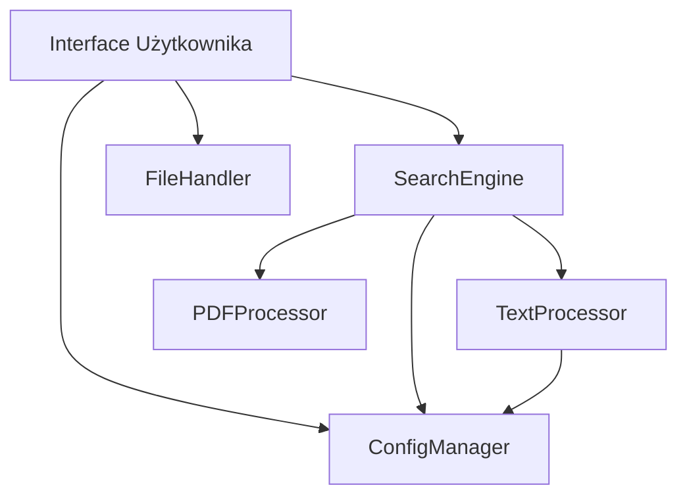

# Przeszukiwarka PDF - Dokumentacja Techniczna

## 1. Architektura Systemu

### 1.1 Komponenty Główne

### 1.2 Szczegóły Implementacji

#### FileHandler (src/utils/file_handler.py)
- **Status**: ✅ Zaimplementowany
- **Odpowiedzialności**:
  - Skanowanie katalogów w poszukiwaniu PDF-ów
  - Walidacja plików PDF
- **Główne metody**:
  - `get_valid_files()`: Zwraca listę poprawnych plików PDF
  - `validate_pdf(file_path)`: Sprawdza czy plik jest poprawnym PDF-em

#### PDFProcessor (src/core/pdf_processor.py)
- **Status**: ✅ Zaimplementowany
- **Odpowiedzialności**:
  - Ekstrakcja tekstu z PDF-ów
  - Wydobywanie metadanych
- **Główne metody**:
  - `extract_text(file_path)`: Wydobywa tekst z PDF-a
  - `extract_title(file_path)`: Wydobywa tytuł dokumentu

#### TextProcessor (src/core/text_processor.py)
- **Status**: ✅ Zaimplementowany
- **Odpowiedzialności**:
  - Tokenizacja tekstu
  - Usuwanie stop words
  - Normalizacja tekstu
  - Obliczanie podobieństwa tekstów
- **Główne metody**:
  - `process_text(text)`: Przetwarza tekst (tokenizacja, stop words, lematyzacja)
  - `calculate_similarity(text1, text2)`: Oblicza podobieństwo tekstów
  - `find_phrase_matches(text, phrase)`: Znajduje wystąpienia frazy w tekście

#### SearchEngine (src/core/search_engine.py)
- **Status**: ✅ Zaimplementowany
- **Odpowiedzialności**:
  - Indeksowanie dokumentów
  - Wyszukiwanie fraz
  - Ranking wyników
- **Główne metody**:
  - `index_document(file_path)`: Indeksuje dokument
  - `search(query)`: Wyszukuje dokumenty
  - `index_directory(directory)`: Indeksuje wszystkie dokumenty w katalogu

#### ConfigManager (src/utils/config.py)
- **Status**: ✅ Zaimplementowany
- **Odpowiedzialności**:
  - Zarządzanie ustawieniami aplikacji
  - Zapisywanie/wczytywanie konfiguracji
- **Główne metody**:
  - `get(key, default)`: Pobiera wartość ustawienia
  - `set(key, value)`: Ustawia wartość
  - `save()`: Zapisuje konfigurację

#### MainWindow (src/ui/main_window.py)
- **Status**: ✅ Zaimplementowany
- **Odpowiedzialności**:
  - Główne okno aplikacji
  - Obsługa interakcji użytkownika
- **Główne metody**:
  - `_init_components()`: Inicjalizacja komponentów UI
  - `_on_folder_select()`: Obsługa wyboru folderu
  - `_on_search()`: Obsługa wyszukiwania

#### ResultsView (src/ui/results_view.py)
- **Status**: ✅ Zaimplementowany
- **Odpowiedzialności**:
  - Wyświetlanie wyników wyszukiwania
  - Sortowanie wyników
  - Podgląd dokumentów
- **Główne metody**:
  - `set_results(results)`: Ustawia wyniki wyszukiwania
  - `_sort_by(column)`: Obsługa sortowania
  - `_on_select()`: Obsługa wyboru wyniku

## 2. Algorytm Wyszukiwania

### 2.1 Przetwarzanie Tekstu
1. Konwersja na małe litery
2. Usunięcie znaków specjalnych i cyfr
3. Tokenizacja (podział na słowa)
4. Usunięcie stop words
5. Lematyzacja (sprowadzenie do formy podstawowej)

### 2.2 Obliczanie Trafności
- Używany jest współczynnik Jaccarda
- Wzór: |A ∩ B| / |A ∪ B|
- A: zbiór słów z zapytania
- B: zbiór słów z dokumentu

### 2.3 Wyświetlanie Wyników
- Sortowanie według trafności (malejąco)
- Wyświetlanie kontekstu (50 znaków przed i po znalezionym tekście)
- Możliwość sortowania po innych kolumnach

## 3. Konfiguracja

### 3.1 Ustawienia Interfejsu
- `window_width`: 800
- `window_height`: 600

### 3.2 Ustawienia Wyszukiwania
- Kontekst: 50 znaków przed i po znalezionym tekście
- Ignorowanie wielkości liter
- Automatyczne pobieranie zasobów NLTK

## 4. Zależności
- PyPDF2>=3.0.0: Obsługa PDF-ów
- NLTK>=3.8.1: Przetwarzanie tekstu
- python-magic>=0.4.27: Walidacja plików
- tkinter: Interfejs użytkownika (wbudowany w Python)

## 5. Testy
- ✅ ConfigManager
- ✅ FileHandler
- ✅ PDFProcessor
- ✅ TextProcessor
- ✅ SearchEngine
- ✅ ResultsView 